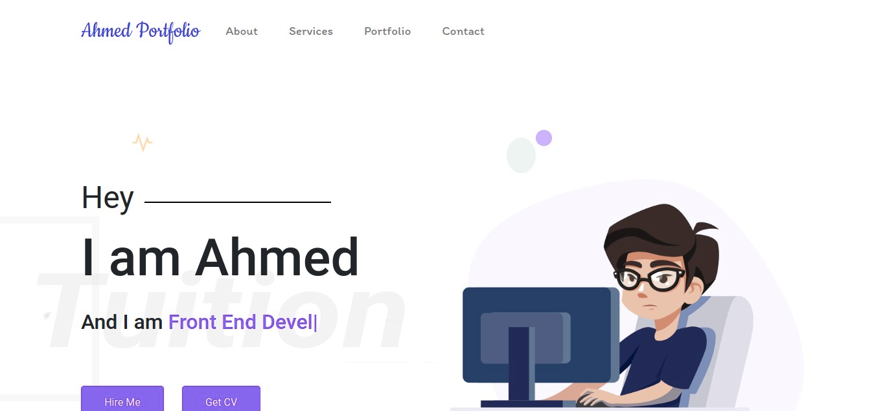

# My-old-PortFolio-Website
this is a Responsive Webpage For My old Portfolio



## Live Link

- Live: [DEMO](https://medobarakat.github.io/My-Portfolio-Site)

## Built with

- Pure JavaScript
- JQuery
- DOM properties and attributes
- HTML & Css

## Getting Started
To get a local copy of the repository please run the following commands on your terminal:
- ```$ cd <folder>```
- ```$ git clone https://github.com/medobarakat/My-old-Portfolio-Site ```
- ```$ cd My-old-PortFolio-Website ```


## Authors

👤 **Ahmed Barakat**
- Github: [@medobarakat](https://github.com/medobarakat)

- Linkedin: [Ahmed Barakat](https://www.linkedin.com/in/ahmed-barakat-dev/)

- Email: [My Gmail](ahmedbarakat2401@gmail.com)

##    Contributing

Contributions, issues and feature requests are welcome!

## Show your support

Give a ⭐️ if you like this project!

## P.S
Changes are frequanclly added

